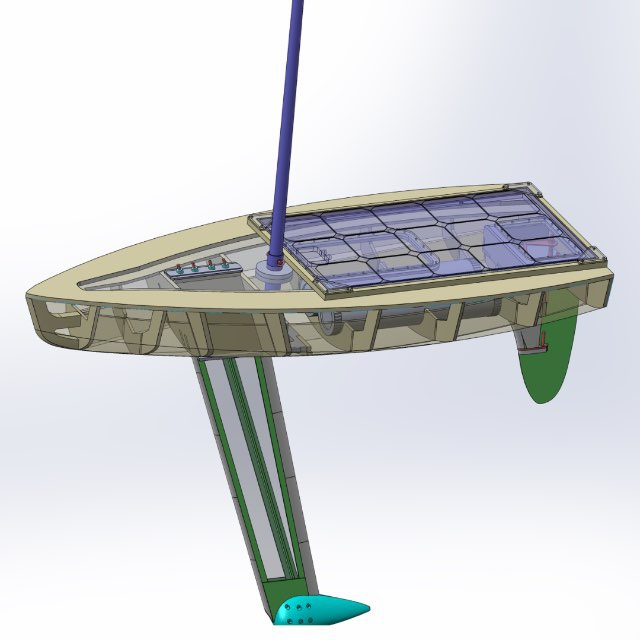
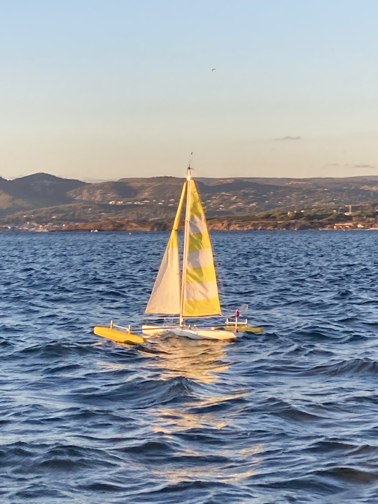
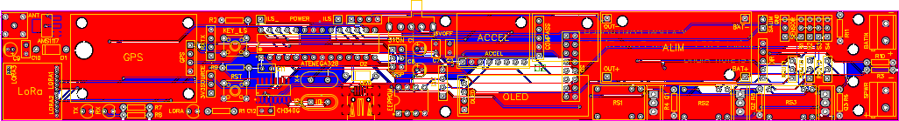
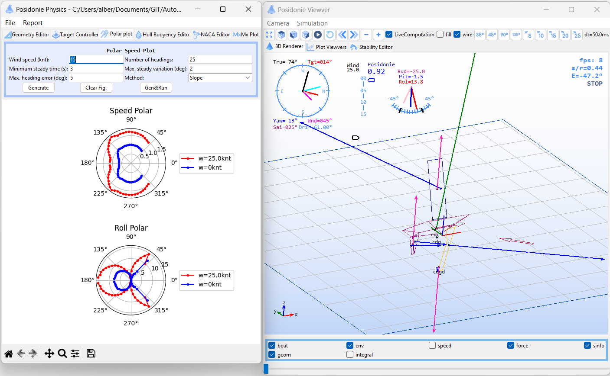
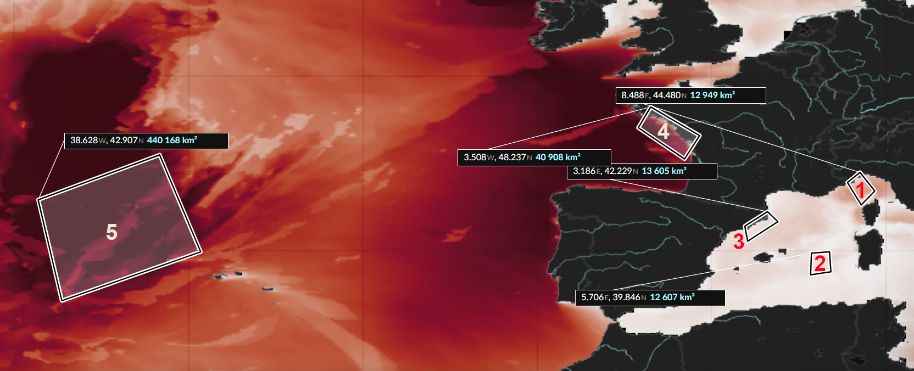
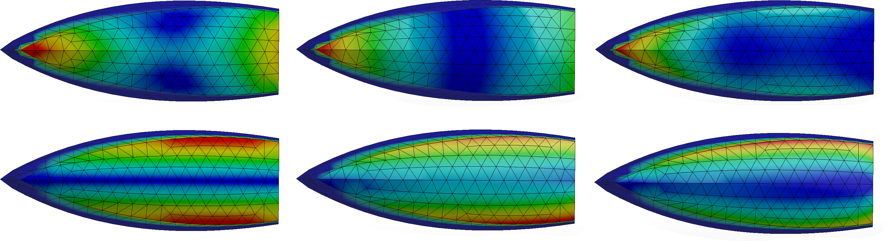
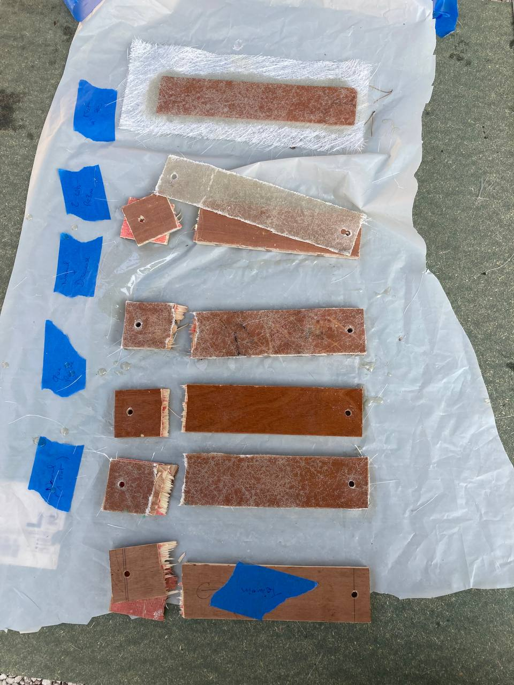
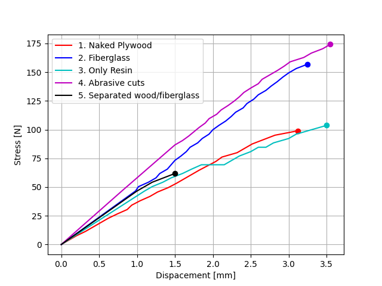
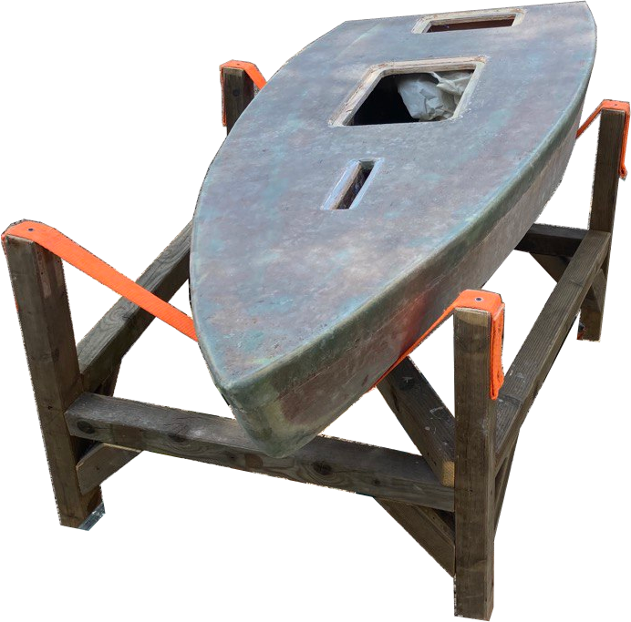

# An Autonomous Sailboat To Cross the Ocean

This GitHub repository presents the engineering of *Posidonie*, a 2-meter sailboat designed to compete in the [Microtransat challenge](https://www.microtransat.org/), which involves crossing the Atlantic Ocean autonomously.

**Fig 1:** The CAD Model of the *Posidonie* monohull autonomous sailboat.

The Journey started with a 1.3-meter prototype, *Baleine*, from an RC M Class sailboat:

**Fig 2:** The *Baleine* saiboat in a upwind course. You may notice the purple windvane at the back. The sail is controlled thanks to an electric winch.

This boat was used to test the control law, the fiberglassing process for the hull, and the architecture of the embedded electronics. 

**Fig 3:** The *Baleine* main PCB. A LoRa module is used to communicate with a ground station. A GPS module and a magnetic compass provide the 6D position of the sailboat.

The promising results validated the global architecture. Meanwhile, the lack of upwind sailing performance ensured the need for a more precise design of the drift and sail area. This sizing is usually performed by a *Velocity Prediction Program* (VPP) program. As an open source VPP for this design was not available, a custom one has been developed:

**Fig 4:** The *Velocity Prediction Program*. From CFD simulations of the Hull, Drift, and Rudder drag and lift, and according to the sail's control law and sail efficiency, different metrics of the sailboat are computed. (Here the polar plot - i.e., the velocity of the boat for different wind incidence)

The VPP program is fed from CDF Simulation of a NACA Profile under turbulent flow (for the drift, sail, and rudder) using COMSOL, and a hull drag profile in a free surface flow (Ansys Fluent).

**Fig 5:** CFD Simulation of the keel's drag and lift as a function of the drift angle (usually around 4°).

**Fig 6:** CFD Simulation of the hull drag. As it is a displacement hull, the wave induced by the boat accounts for more than 60% of the overall drag.

To tackle the effect of waves on rotation movements and loads, a hydrodynamic refraction analysis was performed in Ansys AQWA. Past Weather forecast from the [Copernicus](https://www.copernicus.eu/fr) European model has been used in five typical zones (see Fig.7) to produce a statistical model of the wave's period and amplitude. The response of the hull for the most critical wave gave the location of the main beam of the boat's structure, located in the highest stress point (see Fig.8)

**Fig 7:** Zone considered to build a wave model. It turned out that all the waves created by the wind have similar characteristics. Only the swell greatly varies from each zone.

**Fig 8:** Location of the wave-hull mains pressure point, for the roll and pitch resonating frequency.

From the results of this main design step (sail surface, keel weight, and length...), a CAD model has been proposed (see Fig 1.). The physical implementation uses plywood and fiberglass as the main material. Prelemeray test of the plywood - fiberglass bound ensures a good mechanical strength of the boat:

**Fig 9:** Sample of plywood-fiberglass composite for a strength analysis.

After countless hours, the hull is finally done!

**Fig 10:** The physicall hull before the Epoxy coating